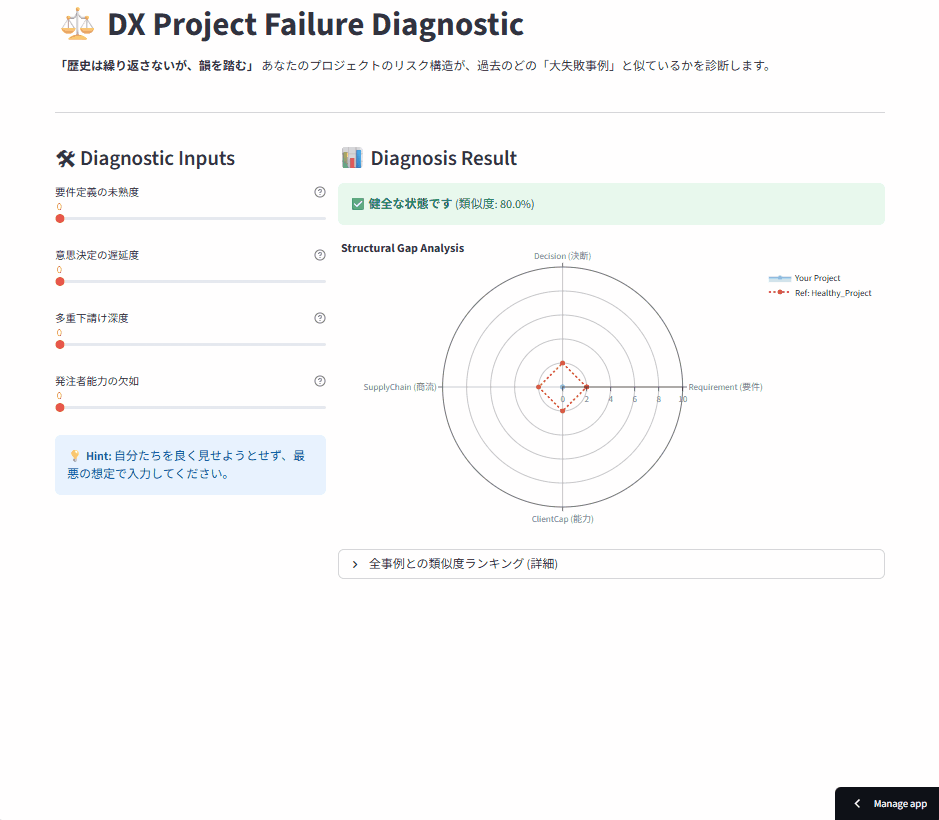

# ⚖️ DX Project Risk Diagnostic — Project Omen
**Case-Based Reasoning × System Dynamics によるDX炎上リスク診断エンジン**

---

## 📸 Dashboard Demo
**▼ あなたのプロジェクトは、過去のどの「大失敗」に似ているか？**
> プロジェクトの構造要因（意思決定速度・商流・要件成熟度）を入力すると、過去の失敗事例DBとの「構造的距離」を計算し、リスク類型を診断します。

---

## 🎯 What This Project Solves
**「DX・基幹刷新プロジェクトは、技術ではなく構造要因で失敗する」**

多くのプロジェクトが、着手前から失敗を運命づけられています。
本ツールは、以下の「失敗の定石」を定量モデル化し、**プロジェクト開始前に「失敗パターン」を検知する意思決定支援ツール（DSS）**です。

* **要件の未確定** (Ambiguity)
* **意思決定の遅延** (Latency)
* **多重下請けによる責任蒸発** (Supply Chain Opacity)
* **発注者の当事者能力不足** (Client Immaturity)
* **人員追加による逆効果** (Brooks's Law)

本ツールはこれらを定量化し、**「あなたのプロジェクトは、どの失敗構造に最も近いか」**を数値で診断します。

---

## 🧠 Design Concept
本システムは、**PMの「勘」ではなく、過去の「データ」に基づいて診断**するために、以下の理論を実装しています。

1.  **Case-Based Reasoning (CBR):**
    * k近傍法（k-NN）のアプローチを応用し、現在のプロジェクトと過去の失敗事例との「ユークリッド距離」を算出。
2.  **System Dynamics / Brooks's Law:**
    * 「人を増やせば解決する」といった直感が、システム工学的に誤りであることを構造スコアに反映。
3.  **Failure Taxonomy:**
    * 成功は多様ですが、失敗の構造は収束します。実在する大規模障害事例を構造化データとして定義しています。

---

## 🔍 Diagnostic Model

### 1. 入力変数（構造リスク因子）
| Variable | 内容 | リスクの意味 |
| :--- | :--- | :--- |
| **Requirement Ambiguity** | 要件未成熟度 | 仕様凍結ができず、手戻りが無限発生するリスク |
| **Decision Latency** | 意思決定遅延 | 決裁ボトルネックにより、開発アイドリングが発生するリスク |
| **Supply Chain Depth** | 商流多層化 | 丸投げ・再委託により、技術的責任所在が蒸発するリスク |
| **Client Immaturity** | 発注者能力不足 | 現行業務を理解していない発注者による「GIGO」構造 |

※スコア範囲：0（健全）〜10（危険）

### 2. 類似度計算ロジック
4次元空間におけるユークリッド距離を計算し、類似度（%）に変換します。

similarity = max(0, (1 - (euclidean_distance / 20)) * 100)
# 類似度が60%未満の場合は「未分類リスク（Unclassified）」として安全側に判定

## 📚 Failure Case Database
実案件・判例・社会的インシデントを構造化データとして搭載しています。

Mizuho 2002: 複雑性の暴走とマルチベンダー管理不全
COCOA App: 多重下請けによるテスト責任の不在
7pay: 経営層のIT無理解とセキュリティ軽視（ガバナンス欠如）
SOFTIC判例: ユーザーの協力義務違反と要件肥大化
JCB基幹刷新: 終わらない要件定義とデスマーチ
SOFTIC 021 (九州屋): ユーザー過失型の失敗モデル

## 📊 Output
PMの主観ではなく、数学的な「構造距離」で診断結果を出力します。
最類似失敗ケース: 最も構造が似ている過去の失敗事例
類似度スコア: 一致率（%）
死因構造説明: なぜそのプロジェクトが失敗したかの解説
レーダーチャート: 自社プロジェクトと失敗事例のギャップ分析

## 🛠 Tech Stack
Language: Python 3.10+

Framework: Streamlit

Logic: NumPy (Vector Calculation), Pandas

Visualization: Plotly (Radar Chart)

## 🔗 Related Project
**診断結果の「金額的インパクト（赤字額）」を知りたい場合はこちら**

> **[💸 DX Project Budget Simulator](https://github.com/keisuke-data-lab/dx-project-failure-structure)** 
> 仕様変更や技術的負債が、最終的にいくらの損失を生むかをシミュレーションするツール
